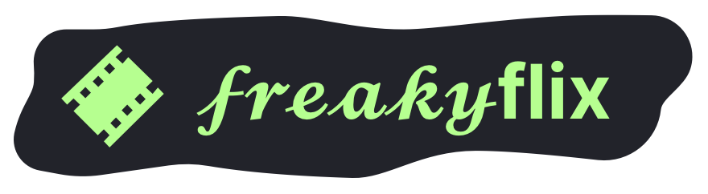

# 𝓯𝓻𝓮𝓪𝓴𝔂flix
[]()

**I *do not* endorse piracy of any kind I simply enjoy programming.**
**Creds to [sussy-code](https://github.com/sussy-code) team for the original project.**

## Links And Resources
| Service        | Link                                                             | Source Code                                              |
|----------------|------------------------------------------------------------------|----------------------------------------------------------|
| Extension      | [𝓯𝓻𝓮𝓪𝓴𝔂extension](https://sussy-code.github.io/docs/extension)         | [source code](https://github.com/sussy-code/browser-ext) |
| Proxy          | 𝓯𝓻𝓮𝓪𝓴𝔂proxy                  | [source code](https://github.com/slvoog/freaky-proxy)  |
| Backend        | [sudo-backend](https://backend.sudo-flix.lol)                    | [source code](https://github.com/sussy-code/backend)     |
| Frontend       | [𝓯𝓻𝓮𝓪𝓴𝔂flix](https://fflx.pages.dev), [2](https://flix.kanded.xyz) | [source code](https://github.com/slvoog/smov)        |


## Running Locally
Type the following commands into your terminal / command line to run 𝓯𝓻𝓮𝓪𝓴𝔂flix locally
```bash
git clone https://github.com/slvoog/smov.git
cd smov
git pull
pnpm install
pnpm run dev
```
Then you can visit the local instance [here](http://localhost:5173) or, at local host on port 5173.


## Updating a 𝓯𝓻𝓮𝓪𝓴𝔂flix Instance
To update a 𝓯𝓻𝓮𝓪𝓴𝔂flix instance you can type the below commands into a terminal at the root of your project.
```bash
git remote add upstream https://github.com/slvoog/smov.git
git fetch upstream # Grab the contents of the new remote source
git checkout <YOUR_MAIN_BRANCH>  # Most likely this would be `origin/main`
git merge upstream/main
# * Fix any conflicts present during merge *
git add .  # Add all changes made during merge and conflict fixing
git commit -m "Update freakyflix instance (merge upstream/main)"
git push  # Push to YOUR repository
```
